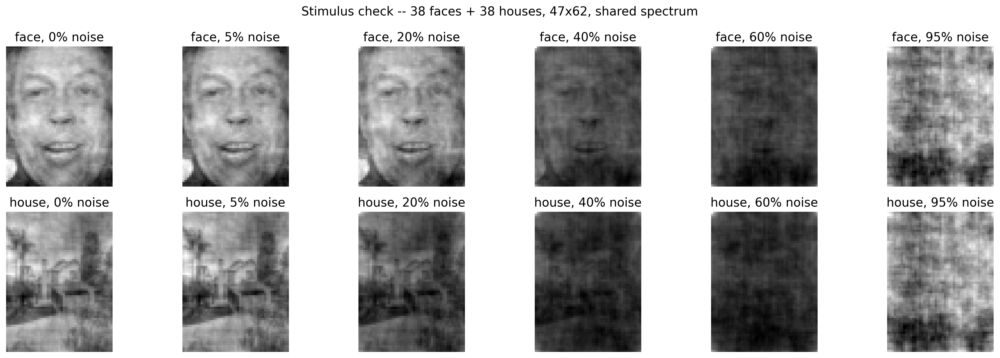
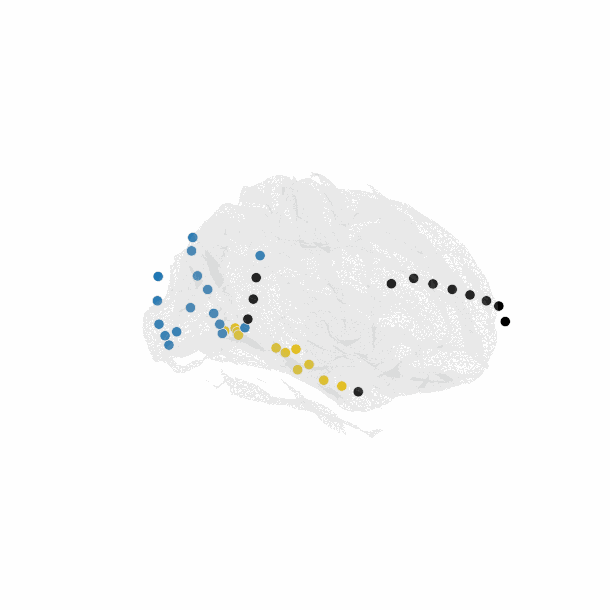
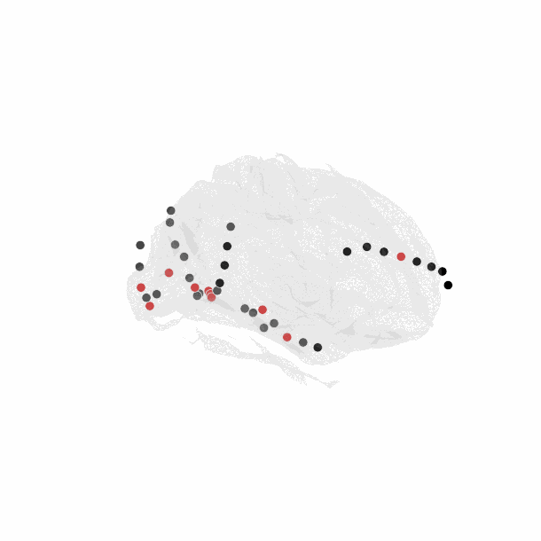

<p align="left"></p>

## Noise-Robust Face Representations: Comparing Human ECoG to CNN Representations of Noisy Faces

Comparing human ECoG face-selective electrodes to CNN (VGG-16) representations under visual noise — RSA, noise injection, and fine-tuning for face detection.

**Team:** Jana, Mariana Nicoli, Rodrigo Castillo, Alexandra Sheridan, Elide Portocarrero

This project was completed as part of [Neuromatch Academy: Computational Neuroscience](https://compneuro.neuromatch.io/).
See the project presentation: [`docs/presentation/Neuromatch Project Presentation.pdf`](docs/presentation/Neuromatch%20Project%20Presentation.pdf) ([.pptx](docs/presentation/Neuromatch%20Project%20Presentation.pptx)).

---

## Overview

How do brain regions and CNN layers correlate during a noisy face-detection task — and how does injecting noise into the CNN, or fine-tuning it for face recognition, change that relationship?

We compare human electrocorticography (ECoG) recordings from face-selective electrodes, ventral-temporal, and early-visual cortex electrodes to the layer-wise representations of a VGG-16 CNN, across 21 levels of phase-scrambled visual noise (0–100%). We repeat the comparison for three CNN variants — a clean ImageNet-trained network, a noise-injected version, and one fine-tuned for face detection — to test whether training objective and robustness shape how "brain-like" a CNN's representations are under noise.

## Dataset & Task

- **ECoG data:** [Miller et al., 2017](https://doi.org/10.1152/jn.00109.2017) — 5 epileptic patients implanted with electrodes in face-selective regions, passively viewing and detecting faces vs. houses.
- **Base stimuli:** 38 face and house images, phase-scrambled via FFT into 21 noise levels (0–100%, 5% steps). Noisy images are recombined with the **average magnitude spectrum across both categories**, so every stimulus shares the same power spectrum and only phase noise varies — this prevents the CNN from decoding category identity from residual spectral structure alone (verified: face-vs-house AUC on 100%-noise images ≈ chance).
- **House images:** [ted8080, *House Prices and Images – SoCal*, Kaggle](https://www.kaggle.com/datasets/ted8080/house-prices-and-images-socal), resolution-matched to the face set.

<p align="center"></p>

## Methods

1. **Group electrodes and CNN layers.**
   - ECoG electrodes split into three groups: **early visual**, **ventral temporal** (anatomical, from electrode coordinates), and **face-selective** (functional — above-chance (AUC = 0.55) face-vs-house discrimination via cross-validated logistic regression).
   - CNN: VGG-16 (ImageNet-pretrained), read out at the 5 pooling layers and 2 fully-connected layers.

   <p align="center">
     
     
   </p>
   <p align="center"><em>Left: early visual (blue) vs. ventral temporal (yellow) electrodes. Right: face-selective electrodes (red).</em></p>
2. **Decision-based collapse threshold.** For each electrode group and each CNN layer, a classifier's face-vs-house AUC is tracked across noise levels; the threshold θ is the noise level where AUC drops below a fixed criterion.
3. **Representational similarity analysis (RSA).** For each subject/electrode-group and each CNN layer, we build a representational dissimilarity matrix (RDM) over all 42 conditions (21 noise levels × 2 categories), using **cross-validated (crossnobis) distance** as the one consistent metric on both the ECoG and CNN sides. ECoG–CNN correspondence is the Spearman correlation between RDMs, averaged across subjects.
4. **Noise sensitivity and latency.** Correspondence is re-examined within sliding noise windows (does it break down at a particular noise level?) and within sliding time windows post-stimulus (does the peak-correspondence latency shift under noise?).
5. **CNN manipulations.** The full RSA pipeline is repeated for (a) noise injected into CNN unit activations at one or all layers, and (b) a CNN fine-tuned for face detection (VGGFace / VGG-16), to test whether robustness and training objective change brain–CNN correspondence.

## Results

- **Depth predicts correspondence.** Across all three electrode groups, ECoG–CNN RDM correlation increases from shallow (pool1) to deep (fc7) layers. Deep layers correspond most strongly to **face-selective cortex** (r ≈ 0.5), then **ventral temporal** (r ≈ 0.34), then **early visual** (r ≈ 0.2) — and the depth-driven increase is steepest for face-selective cortex (0.1 → 0.5) and weakest for early visual (0.06 → 0.2).
- **Correspondence collapses near the human perceptual threshold.** For the deeper, more-correlated layers, ECoG–CNN correspondence drops sharply around **41–47% noise** — close to the ~50–55% behavioral perceptual threshold reported in Miller et al.'s original study. The collapse is steepest for face-selective electrodes, intermediate for ventral temporal, and shallowest (starting from a lower baseline) for early visual.
- **Population-level, decision-based thresholds diverge.** Using a matched classifier-based threshold (all CNN units vs. all electrodes in a group, same AUC criterion), the deep-layer CNN collapses later (θ_CNN ≈ 55%) than the brain (θ_neural ≈ 30–34%) — a genuine, decision-based divergence, distinct from the RSA-based collapse above.
- **Fine-tuning and noise injection both matter.** For face-selective and ventral-temporal cortex, the **fine-tuned (face-trained) CNN** shows the strongest correspondence to ECoG, followed closely by the clean CNN, with the **noise-injected CNN** weakest — most pronounced in the later layers. Early visual cortex is largely insensitive to all three CNN variants.

**In short:** CNN representations increasingly resemble face-selective and ventral-temporal cortex with depth, and this correspondence collapses near the human perceptual threshold. Early visual cortex shows weak, shallow correspondence throughout. Fine-tuning for faces strengthens brain–CNN correspondence; injecting noise weakens it — the CNN's *training objective*, not just its architecture, shapes how brain-like its noisy-face representations are.

## Repository Structure

```
notebooks/     Analysis pipeline, numbered 00-11 and meant to be run in that order.
                 00-02  data setup, stimulus construction, electrode characterization
                 03-06  ECoG/CNN representational similarity analysis (RSA)
                 07-09  per-electrode correspondence and collapse thresholds
                 10-11  CNN noise injection and the VGGFace (fine-tuned) comparison
src/            Shared preprocessing, statistics, and RDM-building functions.
docs/           Write-up (docs/report/) and the Neuromatch presentation (docs/presentation/).
assets/         Static images/GIFs used in this README.
data/           Downloaded inputs (ECoG recordings, stimulus images, CNN weights). Gitignored.
cache/          Intermediate results passed between notebooks. Gitignored.
figures/        Every plot, saved as PNG when produced. Gitignored.
requirements.txt
```

Each notebook loads what it needs from `cache/` (saved by the notebook before it), 
so run them in numeric order the first time; after that, re-running a
single later notebook is fine as long as the earlier ones' cache files already exist. 

Data downloads (ECoG recordings, stimulus images, CNN weights) happen automatically into `data/` the
first time a notebook needs them — no manual setup, but expect the first pass through `00`,
`01`, `05`, and `11` to take a while. 

Notebooks `05`, `10`, and `11` run CNN forward passes and
use CUDA automatically if available, falling back to CPU otherwise.
